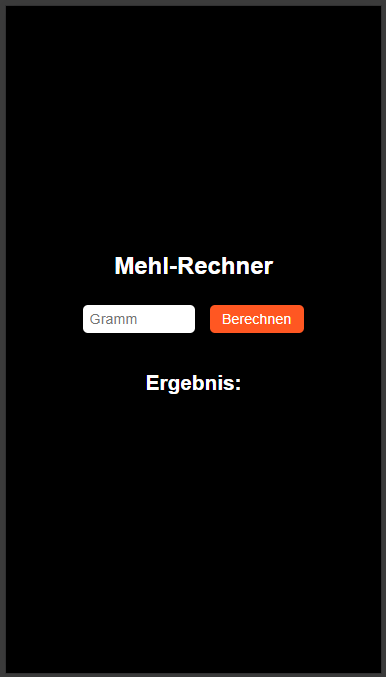

# Mehl-Rechner

Für alle betroffenen, deren Waage spontan den Geist aufgegeben hat, kurz bevor der Teig für die Pizza angemischt werden sollte..

## 🚀 Features

- Trage die gewünschte Menge an (lockerem) Mehl ein.
- Zeigt dir das Ergebnis in frischer Farbe und in Milliliter umgerechnet an.

## 🖼️ Vorschau



## 🛠️ Installation

```bash
git clone https://github.com/mapalummi/Mehl-Rechner.git
cd Mehl-Rechner
npm install
